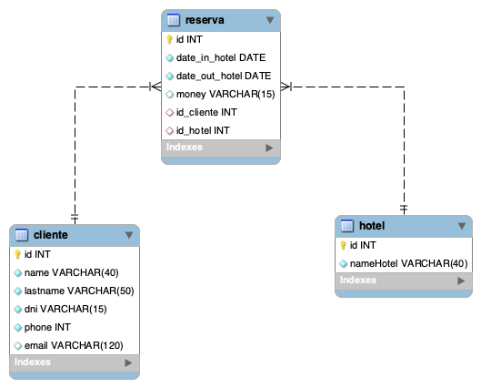

#  API Hotel de Reservas

## Tabla de Contenidos

- [Conocer](#about)
- [Empezar](#getting_started)
- [Uso](#usage)
- [API](#api)

## Conocer <a name = "about"></a>

La API está creada con express.Y tiene una base de datos con las tablas: Clientes, Reservas y Hoteles.
Pudiendo realizar búsquedas  con los siguientees parametros:
Nombre,apellidos,telf.,email,dni,id,hotel,fecha de entrada, fecha de salida.


SERVIDOR DEMO:

<a href="https://hotelreservabd-production.up.railway.app/" target="_blank">https://hotelreservabd-production.up.railway.app/</a>

RUTAS:

 HTTP Verbs | Endpoints | Acción |
| --- | --- | --- |
| GET | /users/ | Lista de todos los clientes |
| GET | /users/id| Busqueda de un cliente por su id |
| GET | users/name/name | Busqueda de un cliente por su nombre |
  GET | users/lastname/lastname | Busqueda cliente por apellido |
| GET |users/email/email| Busqueda de cliente por su email |
| GET |users/dni/dni| Busqueda de cliente por su dni |
| GET | hotel | Busqueda de todos los Hoteles |
| GET | hotel/id | Busqueda de Hotel por su id |
| GET | hotel/namehotel/nameHotel| Busqueda de Hotel por su nombre|
| GET |reserva | Busqueda de todas las reservas|
| GET |reserva/id | Busqueda de las reservas por su id|
| GET |reserva/date_in_hotel/date_in_hotel | Busqueda de reserva por su fecha de entrada|
| GET |reserva/date_out_hotel/date_out_hotel | Busqueda de reserva por su fecha de salida|


##  Empezar <a name = "getting_started"></a>

Para utilizar el buscador de Reservas debes clonar el repositorio y seguir las instrucciones.


### Instalción

Una vez clonado el repositorio para que funcione correctamente y se instalen todas las dependencias requeridas hay que instalar:

```
npm install 
```


## Uso <a name = "usage"></a>

En Desarrollo:

```
npm run dev
```

En producción:
```
npm start
```


Hay unos seeders por si se quiere utilizar el buscador independientemente de la carga de toda la Base de Datos.
Para utilizar los seeders:

```
npx sequelize-cli db:seed:all
```


